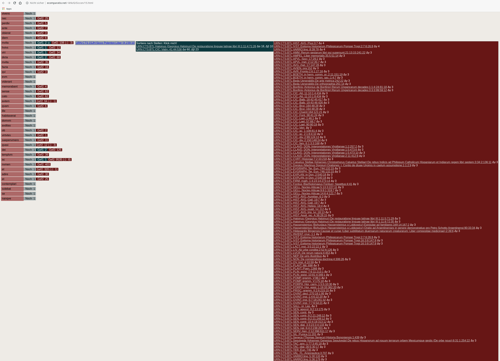

# GPUsearch

This program is a proof concept. The question was, if we are able to hack a string search into a common GPU/OpenGL environment to exploit the parallel computing resources. In this repository we present a python test implementation, that does the proof. There are a view parts of the software given as distinct scripts. First part of the implementation is the data collection, second part is the data encoding, third part is the search and the last part is the data distribution. 

# Technical Background

## GPGPU

The general purpose computation on graphics units was extended to a general model of computational units with the OpenCL and Cuda extensions. To use a implementation in a not so specialized and more ubiquitous environment, maybe even in the browser, OpenGL/GLSL is the key. That implies to properly shape the data, to behave like color values and to restrict a implementation to the shader-language specification and the OpenGL data-model and data-transport. If a problem could be expressed in this restricted terms, one could implement it to compute on the GPU with only a OpenGL environment at hand.

## String Search

The data-type in the text search case is string. A string represents a certain sequence of signs, a humane decodes as text. In short we speak about text-search, meaning sting-search or better sign succession comparison. The last expression hits the problem the best, the other expressions suggests a situation which is not given at all. To implement a string-search on the GPU, we need to transcode the strings into series of colors. For this porpose we choose the word-form level that is represented in the string. The search is implemented as longest common factor, longest common subsequence, biggest subset operation. The search task was to find all occurring of substrings of a given string in the other string. This is the algorithmic worst case included in the problem, that makes the reduction impossible.

## Data

The data should be organized in a folder structure. We use a structure that implements the CTS (canonical text service) specification. The CTS repository could be brought down to a folder structure. The output stage of the program takes the structure of the input data and treats it as the referential structure of the data to be linked to. That enables a linked HTML output and easy integration with the CTS repository. BUT it is also possible to expose the whole input folder structure over a HTTP server and achieve the same result.

## Output

The display of the results does not structure the results in a ranking process and outputs a list. This is important to keep the relation of result an string. That makes the output a study tool of equality between two sign successions that also could enables explorative workflow, language study and sequence analysis.

On the left hand side there is a vertical oriented normalized version of the search string. Next is a label showing how often the substring is contained in the search string. Than two, one or none labels are following denote the results of searching the substring of the search string in the base string. Labels could be selected an the result list shows up. Every list could be ranked by the string distance value. A list entry contains a link to the base string.

# Usage

Currently use the latest Version of python2! First test the if OpenGL related things and the GPU is configured well.

Change to the folder of you extracted the github repository to.

Than run: 

*python2 tesstpyopengl.py*

Add dependences and try again.

Open the *CTStoTXT.py* script and configure it (go to GLOBALS comment) and set pathes and names, as well as screen resolution. Example:

'''# files / pathes
namespace = "15JH" #name of the input of search text
inp1 = "/xx/xx/xx/xx/15JH" #path to folder structure of search text
outpp = "TXT15JH" #output name of search text
   
namespace2 = "BTL" #name of base text
inp2 = "/xx/xx/xx/xx/BTL" #path to folder structure of base text
outpp2 = "TXTBTL" #output name of base text

#screen resolution
w = 1600
h = 1000'''

Than run *python2 CTStoTXT.py*.

Open *TXTencode.py* script and configure it (main section of script).

'''

INfage = "TXT15JH/15JH.txt" #output from the first script
INantwort = "TXTBTL/BTL.txt" #output from the first script
INantwBase = "TXTBTL" #output from the first script
INconcon = "AFconcon" #name of the directory to save the concordance list to
OUTenc = "OUTenc" #directory of encrypted base text
alleFragen = "alleFragen" #directory of encrypted search text -- do not touch this

'''
Than run *python2 TXTencode.py*.

Open *3gpusearch.py* for configuration. Go to GLOBALS comment and set screen resolution, for example:

'''

w = 1600
h = 1000

'''

Than run *python2 parastartGPUsearch.py*.

Open *check.py* for configuration. Go to GLOBALS comment and set the following:

'''

#set screen resolution

w = 1600
h = 1000
outdir = "/xx/xx/Siccon" #path out output directory
pa = "TXT15JH/15JH.txt" #path of search text as txt
pb = "TXTBTL/BTL.txt" #path of base text as txt
ia = "TXT15JH/15JH.index" #path of index of search text
ib = "TXTBTL/BTL.index" #path of index of base text
af = "alleFragen/allefragen.txt" #path of search text (split)

'''

Than run *python2 check.py*.

Done.

# Future Work

- Shift to a different programming language and python3 version.

- Implement more string distances.

- Implement other string levels (like n-gram).

# Other Publications

Friedrich Meins (Leipzig): Muster in antiken Texten: Zur Funktion des Zitates bei Augustinus, 2017 (https://www.hsozkult.de/conferencereport/id/tagungsberichte-7271) 
